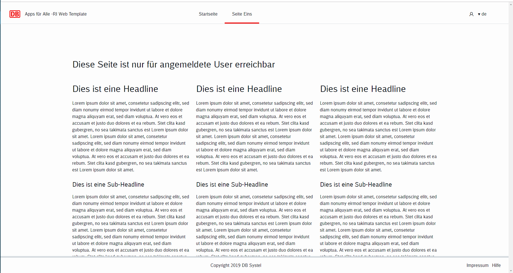
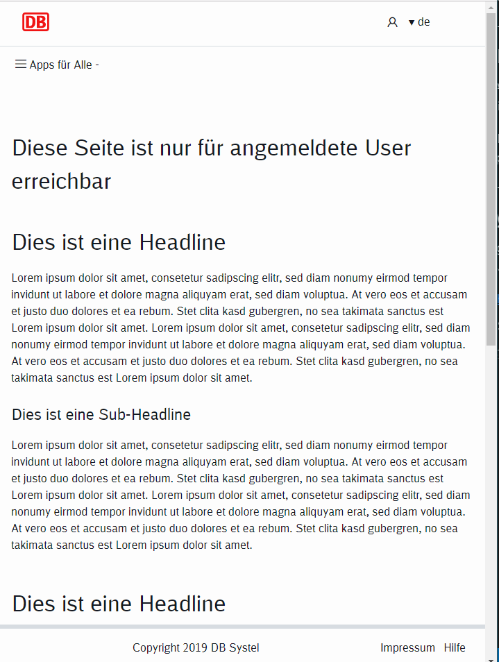
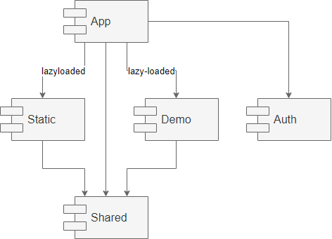

# INSTALLATION

npm install
npm start 
(oder ng serve --open)

# Martin Tipps:

## local build and start nodeJS WebServer
ng build
cd dist/trainorder_frontend
npx http-server 
(Open browser http://localhost:8080)

 
test1

# ---------------------------------
# ORIGINAL README (reference implentation)
# ---------------------------------

# LINKS

:angular-version: 12.x.x
:link-db-ui-core: https://git.tech.rz.db.de/db-ui/db-ui-core[DB UI Core,window=_blank]
:link-cypress: https://www.cypress.io[Cypress,role=external,window=_blank]
:link-angular-styleguide: https://angular.io/guide/styleguide[Angular Styleguide,role=external,window=_blank]
:link-lighthouse: https://developers.google.com/web/tools/lighthouse[Lighthouse,role=external,window=_blank]

# Introduction

This repository contains a template for a new Angular application.
It is a starting point for a new Angular application.

If you use another framework like React or Vue,
then you can read the code in order to find solution for common challenges like:

* OIDC based Authentication (WebSSO, other OIDC provider)
* integration of DB Style (db-ui-core)
* modularization

The best way, is to fork this repository in git as described
link:doc/howToStart.adoc[there].

Screenshot: Desktop

Screenshot:Mobile

## Features / Changes

link:changelog.adoc[Changelog]

## Base is Angular app

The template bases on an angular application created with Angular CLI.
Current Version is {angular-version}.
SCSS is set to default styling processor.

## Basic PWA Features

Basic PWA support is added. It contains manifest file and service worker configuration.
For more information see there: https://angular.io/guide/service-worker-getting-started.

The app shell was not created, because it adds a lot of complexity, which is not required for every project.

## DB Style integrated

The styling is based on {link-db-ui-core} library, which implements the enterprise UI/UX standards.

* Repo: {link-db-ui-core}
* Living Styleguide: https://db.de/db-ui
* Artifactory: https://bahnhub.tech.rz.db.de/artifactory/webapp/#/artifacts/browse/tree/General/db-ui-npm-release-local/@db-ui/db-ui-core/-/@db-ui

Following elements/areas are included:

* Header with Brand, Main Navigation, Meta Navigation
* Footer
* Sample page

## Translation

The app supports multi-language implemented by ngx-translate.
The decision not to use angular i18n is documented link:doc/adr/internalization-lib.adoc[there].

Consider to change it, if ngx-translate is not sufficient.

## Modularization & Lazy loading

The app is divided into 5 Modules

### AppModule
Contains everything required for landing page.
This module is bootstrapped.
Keep it as small as possible.

### SharedModule
Contains functionality, that is used by multiple modules.
E.g. translation, auth.
Keep it small.

### StaticModule (lazy-loaded)
Contains mostly static sites, which are not part of the landing page.
E.g. imprint, help.
This module is lazy loaded.

### DemoModule (lazy-loaded)
This is an example for a feature module.
Structure your application into lazy loaded modules like this.

### AuthModule
Provides support for OIDC based Authentication with WebSSO as default identity provider.

For more details see link:doc/howToAuth.adoc[How to Auth].

## Routing
All modules use default angular routing.
If a route is not found, then it will redirect to `/error/404` by default.

## Documentation

All relevant documentation is in `doc/` folder.
Design decisions are documented in `doc/adr/` folder.

## Testing

In addition to the unit tests defaults, the project is prepared for e2e tests using {link-cypress}.
The decision for using cypress by default is documented in link:doc/adr/e2e-lib.adoc[ADR: e2e Testing Library].
e2e tests containing tests for authentication with WebSSO and an example how to call a rest api from {link-cypress}.

## How to start
link:doc/howToStart.adoc[How to start]

## How to run
Is default angular.
link:doc/howToRun.adoc[How to run]

## How to contribute

If you want to change or add new feature, you can fork this repository and create a pull request.

## Core principals

- keep it simple
- follow the {link-angular-styleguide} and document if you differ from it in `/doc/adr/`` folder.
- *ng test* and *ng e2e* should be successful for every commit
- stay close to db-ui-core and create a merge request to db-ui-core repository if you change it
- analyze your app with lighthouse chrome extension {link-lighthouse}
- use lazy loaded modules for business parts
- keep App module small

## Hosted Demo

The generated output of this application is being hosted on our OpenShift environment: https://kolt-ri-angular.berlin.dbcs.db.de/

## Acknowledgment

link:https://db.de/pipeship[image:https://rgbs-sammelband.berlin.dbcs.db.de/logo_retroship.png[alt="Pipeship logo",width=250height=179, style="float:left;margin:0.375rem;"]]

CI/CD supported by link:https://db.de/pipeship[pipeship], thanks a lot for that!
